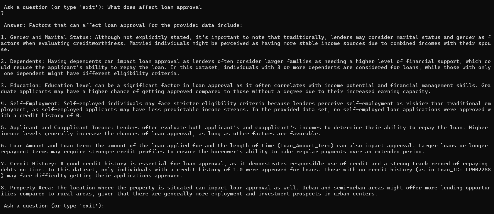

# 🧠 RAG-Loan-Bot: Loan Approval Q&A Chatbot using Ollama + FAISS

A Retrieval-Augmented Generation (RAG) chatbot that answers questions about loan approvals using trained data and lightweight local LLMs like **Mistral via Ollama**. This project uses **LangChain**, **FAISS**, and **Hugging Face Embeddings** for document retrieval and intelligent response generation.

---

## 🚀 Features

- 🔍 Context-aware Q&A powered by your own CSV data
- ⚡ Local LLM (like Mistral) served using [Ollama](https://ollama.com/)
- 🧠 Fast vector search via FAISS
- 🧩 Modular LangChain-based pipeline
- 💬 CLI-based chat + ready for Streamlit UI
- ✅ Easy to extend with visualizations and filters

---

## screenshot

